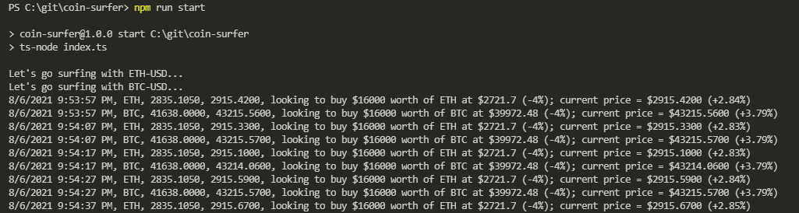
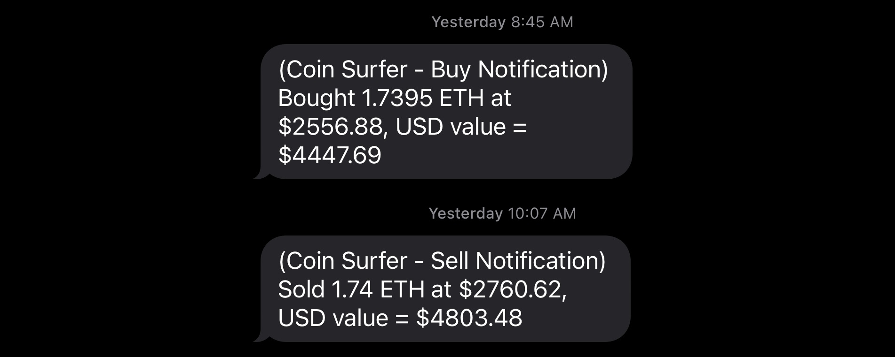
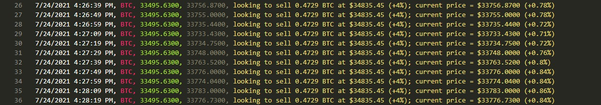
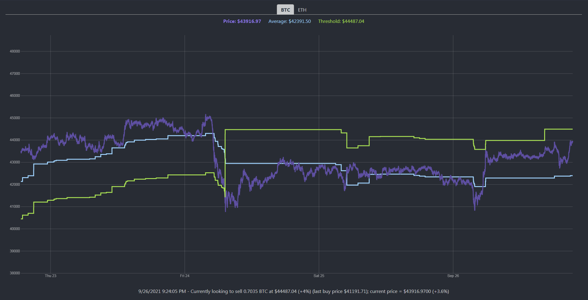

Node.js app for automated cryptocurrency trading

## How it works

The current "simple threshold" surfer works as follows -

1. Check your account balances and decide whether to buy or sell
    - If you have a balance of crypto - look to sell
    - Otherwise check your fiat balance and look to buy
2. Calculate buy / sell thresholds based on threshold percentages
3. Poll the Coinbase API for the current ticker price and 24-hour average price
4. Buy or sell when the threshold is hit (e.g. buy when current price is 4% below average price, sell when 4% above)



Optional text / email notifications can be sent on buy / sell



Logs for each currency are kept if you wish to do historical analysis and optimize your thresholds (or create your own algorithm)



## Visualization
The [web directory](https://github.com/husarms/coin-surfer/tree/master/web) contains a React app for visualizing Coin Surfer as it runs

Check out this folder for more details



## Future goals

1. **Implement some basic AI** - use historical data to automatically adjust and optimize thresholds based on market trends
2. **Know when to hold 'em** - detect abnormal trends in price and override sell threshold to increase profit margin
3. **Know when to fold 'em** - incrementally lower the sell threshold after a period of time (cut your losses if a profit cannot be made quickly)

## TODO
1. Handle bad requests (catch API errors)
2. Handle crashes
    - Stop loss, buy in low, adjust sell margins higher
3. Basic AI - use scoring to adjust thresholds
    - Confidence score 
        - 30-day vs 24-hour average
        - 24h < 30d = more confident, lower buy threshold, higher sell threshold
        - 24h > 30d = less confident, higher buy threshold, lower sell threshold
    - Volatility score 
        - 30-day max and min
        - More volatile = wider thresholds
4. Visualization
    - Experiment with other chart packages
    - Hover over line and see value

## Setup
1. Requires a [Coinbase Pro](https://pro.coinbase.com) account and access to the [Coinbase Pro Api](https://docs.pro.coinbase.com/)
2. Optionally - a [SendGrid](https://sendgrid.com) account to send buy / sell notifications
3. Configure your own "secrets.ts" file under the "config" directory
```JavaScript
export default {
    CoinbaseConfiguration: {
        key: "<Add your key here>",
        secret: "<Add your secret here>",
        passphrase: "<Add your passphrase here>",
    },
    SendGridConfiguration : {
        apiKey: "<Add your api key here>",
    },
    Email: {
        toAddress: "<Add your to address here>",
        fromAddress: "<Add your from address here>",
    },
};
```
5. Set your own parameters for cryptocurrency, buy / sell thresholds and budget in index.ts
```JavaScript
(async () => {
    await SimpleThresholdSurfer.surf({
        fiatCurrency: Products.USDollar,
        cryptoCurrency: Products.Etherium,
        buyThresholdPercentage: 4,
        sellThresholdPercentage: 4,
        budget: 1000,
        notificationsEnabled: true,
        webSocketFeedEnabled: true,
    });
    await SimpleThresholdSurfer.surf({
        fiatCurrency: Products.USDollar,
        cryptoCurrency: Products.Bitcoin,
        buyThresholdPercentage: 4,
        sellThresholdPercentage: 4,
        budget: 1000,
        notificationsEnabled: true,
        webSocketFeedEnabled: false,
    });
})();
```
This example surfs both Bitcoin and Etherium

## How to run
Install depedencies
```bash
npm install
```
Run 
```bash
npm run start
```
