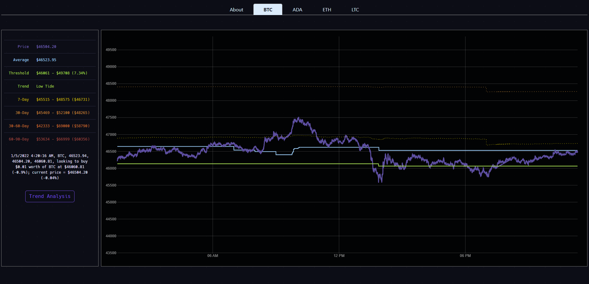

## [Click Here to View Live Demo](https://coin-surfer.herokuapp.com/)

# Contents
- [Overview](#overview)
- [Surfers](#surfers)
    - [Simple Threshold Surfer](#simple-threshold-surfer)
    - [AI Threshold Surfer](#ai-threshold-surfer)   
- [Features](#features)
    - [Logging](#logging)
    - [Notifications](#notifications)
    - [Visualization](#visualization)
    - [Web Socket Feed](#web-socket-feed)
- [Setup](#setup)
- [How to Run](#how-to-run)
- [Deployment](#deployment)
- [TODO](#todo)

# Overview

Coin Surfer is an open-source project for automated cryptocurrency trading. 

It uses "surfers" to continually monitor the cryptocurrency market and determine the best time to make a trade.

This application is fully capable of making real trades, with real money. It can also be used to learn and develop predictive algorithms using real-world live data - without risking anything financially. 

A few [example surfers](#surfers) are provided - or you can write your own utilizing the functions provided in the project.

# Surfers
The included example surfers all work on the same principal - monitor the current price and buy or sell when a threshold is hit. The challenge is deciding what those thresholds should be - and they each use different approaches to determine this.

## Simple Threshold Surfer
The [simple threshold surfer](https://github.com/husarms/coin-surfer/blob/master/surfers/simple-threshold.ts) is the first example iteration and uses the difference between the current price and 24-hour average price.

Buy and sell thresholds are set manually as a percentage difference from the 24-hour average price. The idea is to buy and sell when an unusal drop or increase in price occurs (e.g. 5% above or below the 24-hour average).

Please note that some products are more volatile than others - so choosing the right threshold percentages takes some experimentation.

## AI Threshold Surfer
The [AI threshold surfer](https://github.com/husarms/coin-surfer/blob/master/surfers/ai-threshold.ts) is the second example iteration and uses 7-day and 30-day high and low prices to determine it's own thresholds.

The historical high and low prices are taken from [product candles](https://docs.cloud.coinbase.com/exchange/reference/exchangerestapi_getproductcandles). Rather than waiting for a sudden drop or rise in price - it waits for prices to hit historically low or high levels.

Compared to the simple threshold method - it sets / adjusts itself automatically and seems less risky with the potential for greater margins.

# Features

## Logging

The current state of each surfer is logged to the console at each polling interval.


Logs for each product are kept in the "logs" folder if you wish to do historical analysis.


## Notifications
Optional text or email notifications can be sent on buy / sell actions.


## Visualization
The [web directory](https://github.com/husarms/coin-surfer/tree/master/web) contains a React app for visualizing Coin Surfer as it runs.



## Web Socket Feed
When a web socket feed is enabled (see [Setup](#setup)) - the app emits it's current state on each update interval.

The included [Visualization App](https://github.com/husarms/coin-surfer/tree/master/web) is driven off this feed.

# Setup
1. Requires a [Coinbase Pro](https://pro.coinbase.com) account and access to the [Coinbase Pro Api](https://docs.pro.coinbase.com/)
2. Optionally - a [SendGrid](https://sendgrid.com) account to send buy / sell notifications
3. Create a ```.env``` file under the root directory with the following environment variables
```
BASE_ADDRESS=localhost
COINBASE_API_KEY=
COINBASE_API_SECRET=
COINBASE_API_PASSPHRASE=
ENVIRONMENT=development
PORT=5000
SENDGRID_API_KEY=
SENDGRID_TO_ADDRESS=
SENDGRID_FROM_ADDRESS=
```
4. Set your own surf parameters in [index.ts](https://github.com/husarms/coin-surfer/blob/master/index.ts)

# How to Run
Install depedencies
```bash
npm install
```
Run 
```bash
npm run start
```

# Deployment
The [live demo site](https://coin-surfer.herokuapp.com) is hosted in [Heroku](https://heroku.com).

Deploying your own instance should be straightforward using their [Node.js getting started guide](https://devcenter.heroku.com/articles/getting-started-with-nodejs).

Remember to define the environment variables mentioned in [setup](#setup) in Heroku's "config vars".

# TODO
1. ~~**Implement some basic AI** - use historical data to automatically adjust and optimize thresholds based on market trends~~
2. Establish feedback loop for machine learning - after a buy and sell, replay time period to learn how it can be improved
3. ~~Move secrets to environment variables~~
4. ~~Deploy to cloud (service and web app)~~
5. Improve error handling (API errors)
6. Add more unit tests
7. Visualization
    - Experiment with other chart packages
    - Add ability to hover over charts and get values
