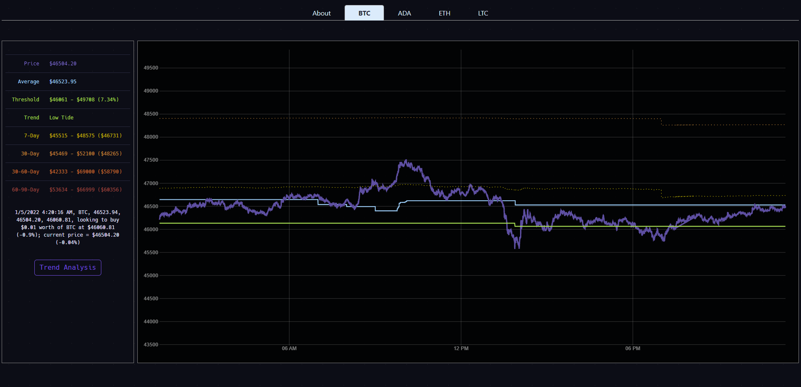

# Coin Surfer Visualization
This web app allows you to visualize Coin Surfer as it runs

It displays the current price, average and threshold over time - as well as status messages



## How to run
1. Enable at least one web socket feed in Coin Surfer via [Surf Parameters](https://github.com/husarms/coin-surfer/blob/master/interfaces/surf-parameters.ts#L8)
2. Ensure Coin Surfer is running ([see how to run](https://github.com/husarms/coin-surfer#how-to-run))
3. Navigate to web directory
4. Install depedencies
  ```bash
  npm install
  ```
5. Run 
  ```bash
  npm run dev
  ```

