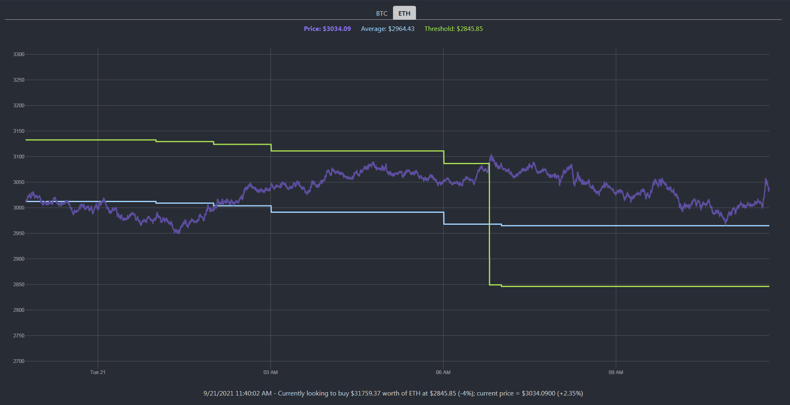

# Coin Surfer Visualization
This web app visualizes Coin Surfer as it runs.

**Important** - the app is dependent on enabling a web socket feed in the main app via [Surf Parameters](https://github.com/husarms/coin-surfer/blob/master/interfaces/surf-parameters.ts#L8). The main app must also be running.

The visualization displays the current price, average and threshold over time - as well as status messages.



## How to run
1. Enable at least one web socket feed in Coin Surfer via [Surf Parameters](https://github.com/husarms/coin-surfer/blob/master/interfaces/surf-parameters.ts#L8).
2. Ensure Coin Surfer is running (see [How to run](https://github.com/husarms/coin-surfer#how-to-run)).
3. Navigate to web directory
4. Install depedencies
```bash
npm install
```
5. Run 
```bash
npm run dev
```

